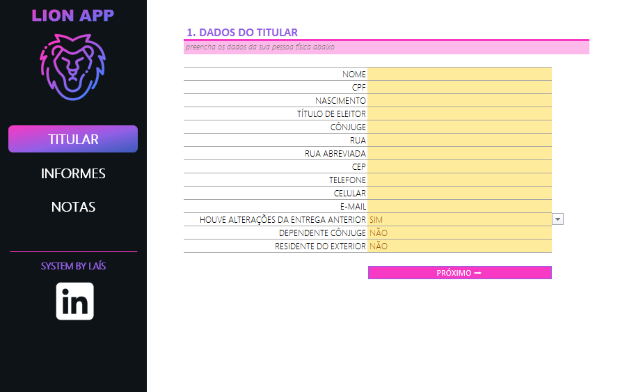
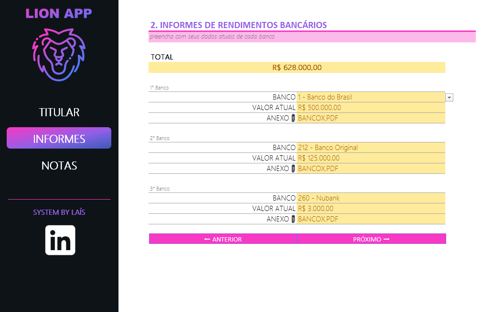

# Ferramenta de Agregador de Dados para Imposto de Renda

Este projeto foi desenvolvido como parte de um desafio da DIO, com o objetivo de criar uma ferramenta no Excel para organizar, validar e consolidar informações essenciais para a declaração de Imposto de Renda.

A planilha funciona como um agregador de dados com validações automáticas, menus de navegação e estrutura organizada para facilitar o preenchimento correto das informações.

---

## Funcionalidades

- Menu de navegação interativo
- Validação automática de dados (reduz erros de digitação)
- Organização das informações por categorias
- Campos padronizados para declaração de IR
- Interface amigável e intuitiva

---

## Como Utilizar

1. Abra o arquivo Excel
2. Use o menu principal para navegar entre as abas
3. Preencha os campos solicitados
4. Utilize os campos com validação para evitar erros
5. Revise os dados consolidados ao final

---

## Estrutura da Planilha

- Aba Titular
- Aba Informes
- Aba Notas

---

## Demonstração

---

## Tecnologias Utilizadas

- Microsoft Excel
- Fórmulas avançadas
- Validação de dados
- Recursos de interface no Excel

---

## Aprendizados

Neste projeto pratiquei:

- Estruturação de planilhas profissionais
- Uso de validação de dados
- Criação de menus de navegação
- Documentação técnica no GitHub

---

## Arquivo

O arquivo Excel está disponível neste repositório.

---

## Autora

Laís Simonelli
Projeto desenvolvido como parte do desafio prático da DIO, seguindo as orientações das videoaulas da plataforma.
